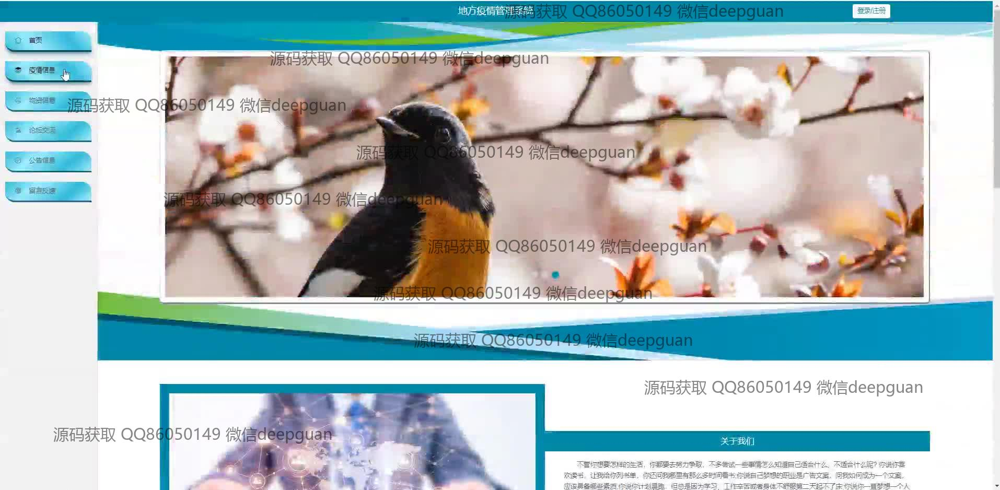

<h1 align="center">地方疫情管理系统</h1>

## 简介
地方疫情管理系统：整合疫情信息管理、健康申报、用户管理、物资统计、外出申请、行程轨迹等多功能模块，支持实时数据更新和多用户互动，提升疫情防控效率。    --计算机毕业设计源码；毕设源码；java毕业设计源码

## 联系方式

<h3 align="center">获取完整代码与数据库文件 + 微信：deepguan QQ: 86050149 QQ群: 783742310</h3>

<h3 align="center">可帮忙远程部署 包运行成功！提供远程部署、修改代码、设计文档指导、代码讲解等服务！</h3>

## 功能介绍（完整见运行截图）
管理员：管理用户信息和疫情相关数据，审核用户提交的信息，管理健康申报、外出申请、物资信息等，通过模块化界面进行用户管理、疫情信息管理、健康申报管理、物资管理、行程轨迹管理和系统公告管理。支持实时疫情数据更新、病例追踪、健康码管理、在线报告，提升系统应对疫情的效率和透明度。

用户：注册并登录系统，填写和管理个人健康申报信息、行程情况，申请健康码或外出许可。浏览和更新个人信息，查看疫情相关公告和资讯，进行社区交流。用户可通过系统提交反馈或留言，与管理员进行互动沟通。

游客：通过首页访问疫情动态和系统公告，了解疫情实时变化和防控措施。浏览疫情相关统计与分析，查看公益宣传和公告信息，与用户交流，获取相关资讯和帮助信息。

## 运行截图

本代码来源于网络,仅供学习参考使用!

